# 🌊 Rouge Wave Analysis with IBM-NASA Geospatial Models

[](https://www.python.org/downloads/)
[](LICENSE)
[](https://huggingface.co/)

> **AI-Powered Ocean Wave Analysis for Maritime Safety and Coastal Protection**

This project demonstrates how to use **IBM-NASA Geospatial models** from Hugging Face to analyze rouge wave data and generate predictions for maritime safety applications. Rouge waves (also known as freak waves or monster waves) are unusually large, unexpected waves that can be dangerous to ships and offshore structures.

## 🎯 What This System Does

The Rouge Wave Analysis system provides:

- **🌊 Wave Data Processing**: Load, clean, and preprocess ocean wave datasets
- **🤖 AI Model Integration**: Use IBM-NASA Geospatial models for intelligent analysis
- **📊 Risk Assessment**: Classify wave conditions as Low/Medium/High risk
- **🎨 Visualization Suite**: Generate comprehensive charts and dashboards
- **📈 Prediction Engine**: Forecast rouge wave probability and wave characteristics
- **🔄 Fallback Mechanisms**: Intelligent fallbacks when AI models are unavailable

## 🏗️ Architecture Overview

```mermaid
flowchart TD
    A[🌊 Wave Data Input] --> B[📊 Data Loader]
    B --> C[🧹 Preprocessing]
    C --> D[🔧 Feature Engineering]
    D --> E[🤖 Model Handler]
    E --> F{AI Model Available?}
    F -->|Yes| G[🚀 IBM-NASA Model]
    F -->|No| H[🔄 Fallback Models]
    F -->|Failed| I[📋 Rule-Based Logic]
    G --> J[📈 Predictor]
    H --> J
    I --> J
    J --> K[📊 Risk Assessment]
    K --> L[🎨 Visualizer]
    L --> M[📁 Output Generation]
    
    subgraph "Data Processing"
        B
        C
        D
    end
    
    subgraph "AI Analysis"
        E
        F
        G
        H
        I
    end
    
    subgraph "Results & Visualization"
        J
        K
        L
        M
    end
    
    style A fill:#e1f5fe
    style M fill:#c8e6c9
    style F fill:#fff3e0
```



## 🔄 Data Flow Pipeline


## 📊 Risk Assessment Flow

```mermaid
flowchart LR
    A[Wave Height] --> D{Risk Assessment}
    B[Wave Period] --> D
    C[Wind Speed] --> D
    
    D --> E{Height > 8m?}
    E -->|Yes| F[🚨 HIGH RISK]
    E -->|No| G{Height > 6m?}
    
    G -->|Yes| H[⚠️ MEDIUM RISK]
    G -->|No| I{Height > 4m?}
    
    I -->|Yes| J[⚡ LOW RISK]
    I -->|No| K[✅ SAFE]
    
    F --> L[Probability: 0.8-1.0]
    H --> M[Probability: 0.4-0.7]
    J --> N[Probability: 0.1-0.3]
    K --> O[Probability: 0.0-0.1]
    
    style F fill:#ffcdd2
    style H fill:#fff3e0
    style J fill:#c8e6c9
    style K fill:#e8f5e8
```



## 🎯 System Components


## 🌊 Wave Data Processing


## 🤖 AI Model Integration Strategy


## 🚀 Quick Start

### Prerequisites

- **Python 3.8+** (tested on Python 3.12)
- **[uv](https://github.com/astral-sh/uv)** - Fast Python package manager and installer
- **Git** for version control
- **8GB+ RAM** recommended for model loading
- **GPU** optional but recommended for faster inference

> **💡 Why uv?** `uv` is significantly faster than traditional pip/venv workflows, with intelligent dependency resolution, parallel downloads, and built-in virtual environment management. It's the modern Python tooling choice.

### Installation

1. **Clone the repository**
   ```bash
   git clone https://github.com/Fedele-AI/RougePredictor
   cd RougePredictor
   ```

2. **Install uv** (if not already installed)
   ```bash
   # On macOS/Linux
   curl -LsSf https://astral.sh/uv/install.sh | sh
   
   # On Windows
   powershell -c "irm https://astral.sh/uv/install.ps1 | iex"
   
   # Or with pip
   pip install uv
   ```

3. **Create and activate virtual environment with uv**
   ```bash
   uv venv
   source .venv/bin/activate  # On Windows: .venv\Scripts\activate
   ```

4. **Install dependencies with uv**
   ```bash
   uv pip install -r requirements.txt
   
   # Alternative: Use uv sync for lockfile-based installs
   uv sync
   ```

5. **Test the installation**
   ```bash
   python test_system.py
   ```

### First Run

1. **Run the demo** (100 samples)
   ```bash
   python demo.py
   ```

2. **Run full analysis** (1000+ samples)
   ```bash
   python rouge_wave_analysis.py --max_samples 1000
   ```

3. **Check outputs**
   ```bash
   ls demo_outputs/     # Demo results
   ls full_analysis_outputs/  # Full analysis results
   ```

## 📁 Project Structure

```
rouge-wave-analysis/
├── 📄 README.md                    # This file
├── 📄 requirements.txt             # Python dependencies
├── 📄 config.yaml                  # Configuration file
├── 📄 .gitignore                   # Git ignore patterns
├── 📁 .venv/                       # Virtual environment (created by uv)
│
├── 🐍 Core Modules
│   ├── rouge_wave_analysis.py     # Main pipeline orchestrator
│   ├── data_loader.py             # Data loading & preprocessing
│   ├── model_handler.py           # Hugging Face model integration
│   ├── predictor.py               # Prediction & risk assessment
│   ├── visualizer.py              # Chart & dashboard generation
│   └── utils.py                   # Helper functions & utilities
│
├── 🧪 Testing & Demo
│   ├── test_system.py             # System functionality tests
│   └── demo.py                    # Demonstration script
│
├── 📊 Configuration
│   └── config.yaml                # YAML configuration
│
├── 📁 Data & Outputs
│   ├── data/                      # Input data directory
│   ├── outputs/                   # Analysis outputs
│   ├── logs/                      # Log files
│   └── model_cache/               # Downloaded models
│
└── 📚 Documentation
    └── README.md                  # This comprehensive guide
```

## 🔧 Core Components

### 1. **Data Loader** (`data_loader.py`)
Handles all data operations:
- **CSV Loading**: Read wave data from various sources
- **Preprocessing**: Clean, normalize, and engineer features
- **Feature Engineering**: Create 22+ derived features
- **Sample Generation**: Generate realistic test data when needed

**Key Features:**
- Automatic missing value handling
- Feature normalization (0-1 scaling)
- Derived features (wave steepness, wind-wave ratios)
- Geospatial features (ocean basin classification)
- Seasonal indicators (summer/winter flags)

### 2. **Model Handler** (`model_handler.py`)
Manages AI model integration:
- **IBM-NASA Models**: Primary geospatial AI models
- **Fallback Models**: Alternative models when primary fails
- **Model Caching**: Local storage for downloaded models
- **Pipeline Creation**: Text generation and analysis pipelines

**Supported Model Types:**
- Regression models for wave height prediction
- Classification models for risk assessment
- General-purpose models for text generation
- Custom pipelines for specialized tasks

### 3. **Predictor** (`predictor.py`)
Generates predictions and risk assessments:
- **Rouge Wave Probability**: 0.0-1.0 risk scores
- **Risk Classification**: Low/Medium/High categories
- **Confidence Scoring**: Model confidence in predictions
- **Analysis Notes**: Human-readable explanations

**Prediction Features:**
- Wave height forecasting
- Wave period estimation
- Risk level classification
- Confidence assessment
- Detailed analysis notes

### 4. **Visualizer** (`visualizer.py`)
Creates comprehensive visualizations:
- **Distribution Plots**: Wave height, probability distributions
- **Geographic Maps**: Risk distribution across locations
- **Time Series**: Temporal analysis of wave conditions
- **Scatter Plots**: Feature relationships and correlations
- **Dashboard**: Comprehensive overview dashboard

**Chart Types:**
- Wave height distribution
- Rouge wave probability analysis
- Geographic risk mapping
- Time series analysis
- Risk level breakdown
- Wave characteristics scatter
- Confidence analysis
- Analysis dashboard

### 5. **Utilities** (`utils.py`)
Provides helper functions:
- **Logging**: Structured logging setup
- **Configuration**: YAML/JSON config management
- **File Operations**: Directory creation, cleanup
- **Dependency Checking**: Environment validation
- **Progress Tracking**: Progress bars and indicators

## ⚙️ Configuration

The system uses `config.yaml` for configuration:

```yaml
model:
  name: "ibm-nasa-geospatial/wave-height-predictor"
  cache_dir: "./model_cache"
  use_fallback: true

data:
  max_samples: 1000
  batch_size: 32

analysis:
  rouge_wave_thresholds:
    high: 0.7
    medium: 0.4
    low: 0.1

output:
  include_plots: true
  plot_dpi: 300
```

## 📊 Data Format

### Input Data Structure
The system expects CSV files with these columns:

| Column | Type | Description | Example |
|--------|------|-------------|---------|
| `timestamp` | datetime | Measurement time | `2023-01-01 00:00:00` |
| `latitude` | float | Geographic latitude | `40.7128` |
| `longitude` | float | Geographic longitude | `-74.0060` |
| `wave_height` | float | Wave height in meters | `2.5` |
| `wave_period` | float | Wave period in seconds | `8.0` |
| `wind_speed` | float | Wind speed in m/s | `15.0` |
| `wind_direction` | float | Wind direction in degrees | `180.0` |

### Generated Features
The system automatically creates 22+ derived features:

- **Time Features**: Hour, day of week, month, seasonal flags
- **Wave Features**: Wave steepness, normalized heights
- **Wind Features**: Wind-wave ratios, normalized speeds
- **Geospatial**: Ocean basin, distance from equator, grid coordinates
- **Risk Indicators**: Rouge wave probability, confidence scores

## 🎯 Usage Examples

### Basic Analysis
```bash
# Analyze 100 samples with default settings
python rouge_wave_analysis.py

# Analyze 1000 samples with custom output directory
python rouge_wave_analysis.py --max_samples 1000 --output_dir my_analysis

# Use specific IBM-NASA model
python rouge_wave_analysis.py --model_name "ibm-nasa-geospatial/specific-model"
```

### Custom Configuration
```bash
# Override configuration parameters
python rouge_wave_analysis.py \
  --max_samples 500 \
  --batch_size 64 \
  --output_dir custom_outputs
```

### Demo Mode
```bash
# Quick demonstration (100 samples)
python demo.py

# Quick functionality test
python demo.py --quick
```

## 🔍 Understanding the Outputs

### 1. **Predictions** (`wave_predictions.csv`)
- **Input Data**: Original wave measurements
- **Predictions**: Forecasted wave characteristics
- **Risk Assessment**: Rouge wave probability and risk levels
- **Confidence**: Model confidence in predictions
- **Analysis**: Human-readable explanations

### 2. **Visualizations** (PNG files)
- **Distribution Plots**: Statistical distributions of key metrics
- **Geographic Maps**: Spatial distribution of risk levels
- **Time Series**: Temporal patterns and trends
- **Correlation Plots**: Relationships between variables
- **Dashboard**: Comprehensive overview

### 3. **Reports** (`analysis_report.txt`)
- **Summary Statistics**: Key metrics and counts
- **Risk Breakdown**: Distribution of risk levels
- **Recommendations**: Actionable insights
- **Data Coverage**: Geographic and temporal scope

## 🚨 Risk Assessment

### Risk Level Classification

| Risk Level | Rouge Wave Probability | Description | Action Required |
|------------|----------------------|-------------|-----------------|
| **Low** | 0.0 - 0.3 | Normal conditions | Monitor routinely |
| **Medium** | 0.3 - 0.7 | Elevated risk | Exercise caution |
| **High** | 0.7 - 1.0 | Dangerous conditions | Immediate attention |

### Risk Factors
The system considers multiple factors:
- **Wave Height**: Primary indicator of risk
- **Wave Steepness**: Height-to-period ratio
- **Wind Conditions**: Wind speed and direction
- **Geographic Location**: Ocean basin and latitude
- **Seasonal Patterns**: Time of year effects

## 🔧 Troubleshooting

### uv Commands Reference
```bash
# Create virtual environment
uv venv

# Activate environment
source .venv/bin/activate  # On Windows: .venv\Scripts\activate

# Install packages
uv pip install package_name
uv add package_name

# Install from requirements
uv pip install -r requirements.txt

# Install development dependencies
uv add --dev package_name

# Update packages
uv pip install --upgrade package_name

# Remove packages
uv pip uninstall package_name

# Show installed packages
uv pip list

# Run commands in environment
uv run python script.py
uv run pytest
```

### Common Issues

1. **Model Loading Fails**
   ```bash
   # Check internet connection
   # Verify model name in config.yaml
   # Check available disk space
   ```

2. **Memory Issues**
   ```bash
   # Reduce batch size in config.yaml
   # Use smaller max_samples
   # Close other applications
   ```

3. **Dependency Problems**
   ```bash
   # Reinstall dependencies with uv
   uv pip install -r requirements.txt --force-reinstall
   
   # Check Python version (3.8+ required)
   python --version
   ```

### Debug Mode
```bash
# Enable debug logging
export LOG_LEVEL=DEBUG
python rouge_wave_analysis.py

# Check system status
python test_system.py
```

## 🚀 Advanced Usage

### Custom Models
```python
from model_handler import GeospatialModelHandler

# Use custom Hugging Face model
handler = GeospatialModelHandler("your-org/your-model")
model = handler.load_model()
```

### Custom Data Sources
```python
from data_loader import WaveDataLoader

# Load custom data
loader = WaveDataLoader()
data = loader.load_data("path/to/your/data.csv")
processed = loader.preprocess_data(data)
```

### Custom Visualizations
```python
from visualizer import WaveVisualizer

# Create custom charts
viz = WaveVisualizer()
viz.create_custom_plot(data, "custom_chart.png")
```

## 🤝 Contributing

We welcome contributions! Here's how to get started:

1. **Fork the repository**
2. **Create a feature branch**: `git checkout -b feature/amazing-feature`
3. **Make your changes**
4. **Add tests**: `python test_system.py`
5. **Commit with gitmoji**: `🙈 Add amazing feature`
6. **Push and create a pull request**

### Development Setup
```bash
# Install development dependencies with uv
uv pip install -r requirements.txt
uv pip install pytest black flake8

# Alternative: Use uv add for development dependencies
uv add --dev pytest black flake8

# Run tests
python test_system.py

# Format code
black *.py

# Lint code
flake8 *.py

# Update dependencies
uv pip install --upgrade -r requirements.txt
```

## 📚 Further Reading

- [Hugging Face Transformers](https://huggingface.co/docs/transformers/)
- [IBM-NASA Geospatial Models](https://huggingface.co/organizations/ibm-nasa-geospatial)
- [Ocean Wave Analysis](https://en.wikipedia.org/wiki/Rogue_wave)
- [Maritime Safety](https://www.imo.org/en/OurWork/Safety/Pages/Default.aspx)

## 📄 License

This project is licensed under the LGPLv3 License - see the [LICENSE](LICENSE.md) file for details.

## 🙏 Acknowledgments

- **IBM-NASA Geospatial** for providing cutting-edge AI models
- **Hugging Face** for the transformers library and model hub
- **Open Source Community** for the amazing tools and libraries
- **Oceanographers** for insights into wave dynamics

## 📞 Support

- **Issues**: [GitHub Issues](https://github.com/your-org/rouge-wave-analysis/issues)
- **Discussions**: [GitHub Discussions](https://github.com/your-org/rouge-wave-analysis/discussions)
- **Documentation**: [Project Wiki](https://github.com/your-org/rouge-wave-analysis/wiki)

---

**🌊 Happy analyzing! May your waves be predictable and your predictions accurate!**

*Built with ❤️ for maritime safety and ocean science* 

## 📁 Output Structure


## 🚀 Installation Process

```mermaid
flowchart TD
    A[Start Installation] --> B{Check Prerequisites}
    B -->|Python 3.8+| C[Install uv Package Manager]
    B -->|Missing Python| D[Install Python 3.8+]
    D --> C
    
    C --> E[Create Virtual Environment with uv]
    E --> F[Activate Environment]
    F --> G[Install Dependencies with uv]
    
    G --> H{Dependencies Installed?}
    H -->|Yes| I[Create Project Directories]
    H -->|No| J[Error: Check System Dependencies]
    J --> K[Install System Dependencies]
    K --> G
    
    I --> L[Test Installation]
    L --> M{Tests Passed?}
    M -->|Yes| N[🎉 Installation Complete!]
    M -->|No| O[⚠️ Some Tests Failed]
    
    N --> P[Ready to Use]
    O --> P
    
    style A fill:#e8f5e8
    style N fill:#c8e6c9
    style P fill:#e1f5fe
```



## 🔍 Analysis Workflow

